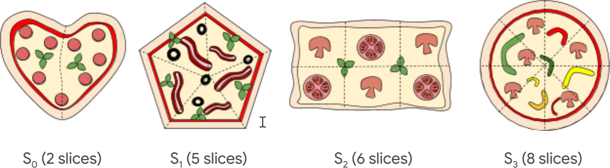

# Google Hash Code 2020 - more pizza :pizza:
## Problem description

You are organizing a Hash Code hub and want to order pizza for your hub’s participants. Luckily, there is a nearby pizzeria with really good pizza.  
The pizzeria has different types of pizza, and to keep the food offering for your hub interesting, you can only order **at most one pizza of each type**.  
Fortunately, there are many types of pizza to choose from! Each type of pizza has a specified size: the size is the number of slices in a pizza of this type.  
You estimated the maximum number of pizza slices that you want to order for your hub based on the number of registered participants. In order to reduce food waste, your goal is to order **as many pizza slices as possible**, but **not more than the maximum number**.

## Score

| Input File | My Score | Max Score | % |
|------------|----------|-----------|---|
|A - example |16|17|94.12|
|B - small|100|100|100|
|C - medium| 4500|4500| 100
|D - quite_big| 999999932|1000000000| 99.999993
|E - also_big| 505000000|505000000| 100
|Total score:| 1505004548|1505004617| 99.999995
